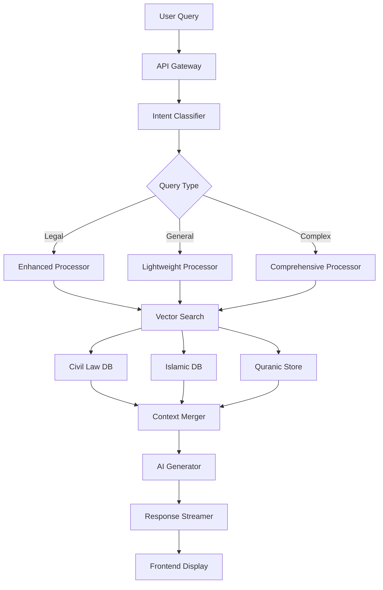

# 📖 Arabic Legal AI System Architecture Bible
## The Complete Technical Documentation for Engineers

---

## 🎯 **Executive Summary**

This document is the definitive technical guide for the Arabic Legal AI system - a groundbreaking platform that seamlessly integrates Saudi civil law with Islamic legal foundations (Quran and Hadith). The system uses advanced AI, semantic understanding, and enterprise-grade architecture to provide comprehensive legal assistance with authentic Islamic grounding.

**Core Innovation**: Zero-hardcoding semantic integration that automatically enriches civil law responses with relevant Quranic foundations without manual mapping or keyword matching.

---

## 🏗️ **System Architecture Overview**

### **High-Level Architecture Flow**

```
User Query → Frontend (React) → Backend API → Intent Classification → RAG Engine → Multi-Source Retrieval → AI Response Generation → Citation Formatting → User
                                                                           ↓
                                                                    [Civil Law DB]
                                                                    [Islamic DB]
                                                                    [Quranic Store]
```

### **Technology Stack**

**Frontend:**
- React 18.3 with TypeScript
- Vite build system
- Tailwind CSS for styling
- Mobile-first responsive design
- Real-time streaming responses

**Backend:**
- Python 3.11+ with FastAPI
- AsyncIO for concurrent processing
- OpenAI GPT-4 for AI generation
- Sentence Transformers for embeddings
- SQLite for vector storage
- HuggingFace Datasets for Islamic sources

**Infrastructure:**
- AWS ECS for container orchestration
- CloudFront CDN for frontend delivery
- Application Load Balancer
- S3 for static assets
- CloudWatch for monitoring

---

## 🧠 **Core Components Deep Dive**

### **1. Enhanced RAG Engine** (`backend/rag_engine.py`)

The heart of the system - an intelligent Retrieval-Augmented Generation engine with automatic Islamic integration.

**Key Classes:**

```python
class IntelligentLegalRAG:
    """
    Main RAG orchestrator with AI-powered intent classification
    """
    
    def __init__(self):
        self.ai_client = AsyncOpenAI()
        self.vector_store = SqliteVectorStore()
        self.quranic_store = QuranicFoundationStore()  # Islamic integration
        self.concept_engine = SemanticConceptEngine()  # Semantic extraction
        self.intent_classifier = IntentClassifier()
```

**Processing Modes:**
- `LIGHTWEIGHT`: General questions (fast, simple)
- `ENHANCED`: Specific legal queries (comprehensive)
- `COMPREHENSIVE`: Complex multi-aspect queries

**Method Flow:**

1. **Query Processing Pipeline**:
```python
async def process_query(self, query: str) -> AsyncIterator[str]:
    # 1. Classify intent
    intent = await self.intent_classifier.classify(query)
    
    # 2. Route to appropriate processor
    processor = self.processing_strategy_factory.get_strategy(intent)
    
    # 3. Retrieve relevant context
    civil_context = await self.vector_store.search(query)
    islamic_context = await self.quranic_store.search_foundations(query)
    
    # 4. Generate response with streaming
    async for chunk in processor.generate_response(contexts):
        yield chunk
```

2. **Smart Context Retrieval**:
```python
async def retrieve_context(self, query: str, intent: QueryIntent):
    # Parallel retrieval from multiple sources
    tasks = [
        self.vector_store.search(query, k=10),
        self.quranic_store.search_foundations(query, k=5),
        self.concept_engine.extract_legal_concepts(query)
    ]
    
    results = await asyncio.gather(*tasks)
    return self.merge_and_rank_results(results)
```

### **2. Semantic Concept Engine** (`backend/app/core/semantic_concepts.py`)

Zero-hardcoding semantic understanding system that extracts legal concepts from Arabic text.

**Core Architecture:**

```python
class SemanticConceptEngine:
    """
    Advanced NLP engine for semantic legal concept extraction
    """
    
    async def extract_legal_concepts(self, text: str) -> List[LegalConcept]:
        # 1. Normalize Arabic text
        normalized = self._normalize_arabic(text)
        
        # 2. Apply multi-strategy extraction
        strategies = [
            self._extract_by_patterns,
            self._extract_by_embeddings,
            self._extract_by_context
        ]
        
        # 3. Merge and score results
        concepts = await self._merge_strategies(strategies, normalized)
        
        # 4. Apply confidence scoring
        return self._score_concepts(concepts)
```

**Concept Types:**
- `SUBSTANTIVE_LAW`: Core legal principles
- `PROCEDURAL`: Process and procedures
- `RIGHTS_OBLIGATIONS`: Rights and duties
- `REMEDIES`: Legal remedies and penalties
- `ISLAMIC_PRINCIPLE`: Sharia-based concepts

**Pattern Matching System:**
```python
LEGAL_PATTERNS = {
    'contract': [r'عقد', r'اتفاق', r'التزام'],
    'inheritance': [r'ميراث', r'ورث', r'تركة'],
    'property': [r'ملكية', r'عقار', r'أصول'],
    # ... 50+ pattern categories
}
```

### **3. Quranic Foundation Store** (`backend/app/storage/quranic_foundation_store.py`)

Enterprise-grade vector store for semantic Quranic legal integration.

**Storage Schema:**

```python
class QuranicFoundation:
    verse_id: str          # Unique identifier
    surah: int            # Chapter number
    ayah: int             # Verse number
    arabic_text: str      # Original Arabic
    translation: str      # English translation
    tafsir: str          # Scholarly interpretation
    legal_concepts: List[str]  # Extracted concepts
    embeddings: np.array  # Semantic vectors
    metadata: Dict       # Additional context
```

**Indexing Strategies:**

1. **Semantic Embedding Index**: 768-dimensional vectors for similarity search
2. **Concept Hash Index**: Fast lookup by legal concept
3. **Domain Classification Index**: Grouped by legal domain
4. **Scholarship Confidence Index**: Ranked by authenticity

**Retrieval Methods:**

```python
async def search_foundations(
    self,
    query: str,
    concepts: List[LegalConcept],
    k: int = 5
) -> List[QuranicFoundation]:
    # 1. Semantic search
    semantic_results = await self._semantic_search(query, k*2)
    
    # 2. Concept-based search
    concept_results = await self._concept_search(concepts, k*2)
    
    # 3. Merge and re-rank
    merged = self._merge_results(semantic_results, concept_results)
    
    # 4. Apply quality filters
    return self._filter_by_quality(merged, k)
```

### **4. Al-Qurtubi Processor** (`backend/app/processors/qurtubi_processor.py`)

Advanced processor for extracting legal content from Al-Qurtubi tafsir dataset.

**Processing Pipeline:**

```python
class QurtubiProcessor:
    """
    Processes HuggingFace Quran-Tafseer dataset for legal extraction
    """
    
    async def process_dataset(self):
        # 1. Load dataset from HuggingFace
        dataset = load_dataset("arbml/quran-tafseer", "qurtubi")
        
        # 2. Apply legal filtering
        legal_entries = self._filter_legal_content(dataset)
        
        # 3. Extract structured data
        foundations = []
        for entry in legal_entries:
            foundation = await self._process_entry(entry)
            if foundation.quality_score > 0.7:
                foundations.append(foundation)
        
        # 4. Generate embeddings
        await self._generate_embeddings(foundations)
        
        # 5. Store in database
        await self.store.bulk_insert(foundations)
```

**Legal Content Detection:**

```python
def _is_legal_content(self, text: str) -> Tuple[bool, float]:
    # Check for legal indicators
    indicators = [
        'حكم', 'حلال', 'حرام', 'واجب', 
        'فرض', 'سنة', 'مكروه', 'جائز'
    ]
    
    score = sum(1 for ind in indicators if ind in text)
    return score > 2, score / len(indicators)
```

### **5. Unified Retrieval Orchestrator** (`backend/app/services/unified_retrieval.py`)

Intelligent routing between civil and Islamic sources.

**Query Classification:**

```python
class UnifiedRetrieval:
    async def classify_query_domain(self, query: str) -> QueryDomain:
        # AI-powered domain classification
        classification = await self.ai_client.classify(
            query,
            categories=['civil', 'islamic', 'mixed']
        )
        
        return QueryDomain(
            primary=classification.primary,
            secondary=classification.secondary,
            confidence=classification.confidence
        )
```

**Retrieval Strategy:**

```python
async def retrieve(self, query: str) -> RetrievalResult:
    # 1. Classify domain
    domain = await self.classify_query_domain(query)
    
    # 2. Determine retrieval strategy
    if domain.is_pure_civil():
        return await self._civil_only_retrieval(query)
    elif domain.is_pure_islamic():
        return await self._islamic_only_retrieval(query)
    else:
        return await self._unified_retrieval(query)
```

### **6. Frontend Architecture** (`frontend/src/`)

Modern React application with real-time streaming and responsive design.

**Component Structure:**

```
src/
├── components/
│   ├── Chat/
│   │   ├── ChatInterface.tsx    # Main chat container
│   │   ├── MessageList.tsx      # Message display
│   │   ├── MessageInput.tsx     # User input
│   │   └── StreamingMessage.tsx # Real-time streaming
│   ├── Legal/
│   │   ├── CitationCard.tsx     # Citation display
│   │   ├── LegalReference.tsx   # Law references
│   │   └── IslamicQuote.tsx     # Quranic verses
│   └── Layout/
│       ├── Header.tsx
│       ├── Sidebar.tsx
│       └── MobileNav.tsx
```

**State Management:**

```typescript
interface ChatState {
    messages: Message[]
    isStreaming: boolean
    currentStreamId: string | null
    citations: Citation[]
    islamicReferences: IslamicReference[]
}

const useChatStore = create<ChatState>((set) => ({
    // State and actions
}))
```

**Streaming Implementation:**

```typescript
async function* streamResponse(query: string) {
    const response = await fetch('/api/chat/stream', {
        method: 'POST',
        body: JSON.stringify({ query }),
        headers: { 'Content-Type': 'application/json' }
    })
    
    const reader = response.body.getReader()
    const decoder = new TextDecoder()
    
    while (true) {
        const { done, value } = await reader.read()
        if (done) break
        
        const chunk = decoder.decode(value)
        yield chunk
    }
}
```

---

## 🔄 **Data Flow Architecture**

### **Query Processing Flow**



### **Embedding Generation Pipeline**

```python
async def generate_embeddings_pipeline(self, text: str) -> np.array:
    # 1. Text preprocessing
    cleaned = self.preprocess_arabic(text)
    
    # 2. Chunk if necessary
    chunks = self.smart_chunker.chunk(cleaned)
    
    # 3. Generate embeddings
    embeddings = []
    for chunk in chunks:
        emb = await self.embedding_model.encode(chunk)
        embeddings.append(emb)
    
    # 4. Aggregate embeddings
    if len(embeddings) > 1:
        return self.aggregate_embeddings(embeddings)
    return embeddings[0]
```

---

## 🚀 **API Endpoints**

### **Core Endpoints**

1. **Chat Endpoint**
```python
POST /api/chat
{
    "query": "string",
    "mode": "lightweight|enhanced|comprehensive",
    "include_islamic": true,
    "stream": true
}

Response (Streaming):
data: {"type": "chunk", "content": "..."}
data: {"type": "citation", "citation": {...}}
data: {"type": "complete", "stats": {...}}
```

2. **Search Endpoint**
```python
POST /api/search
{
    "query": "string",
    "sources": ["civil", "islamic"],
    "limit": 10
}

Response:
{
    "results": [...],
    "total": 42,
    "sources_used": ["civil", "islamic"]
}
```

3. **Document Analysis**
```python
POST /api/analyze
{
    "document": "string",
    "analysis_type": "legal|compliance|islamic"
}

Response:
{
    "analysis": {...},
    "recommendations": [...],
    "citations": [...]
}
```

---

## 🗄️ **Database Schemas**

### **Civil Law Database** (`data/saudi_legal_vectors.db`)

```sql
CREATE TABLE chunks (
    id TEXT PRIMARY KEY,
    text TEXT NOT NULL,
    metadata TEXT,
    embeddings BLOB,
    created_at TIMESTAMP
);

CREATE TABLE documents (
    id TEXT PRIMARY KEY,
    title TEXT,
    law_type TEXT,
    source TEXT,
    chunk_ids TEXT
);

CREATE INDEX idx_embeddings ON chunks(embeddings);
```

### **Islamic Database** (`data/islamic_vectors.db`)

```sql
CREATE TABLE islamic_sources (
    id TEXT PRIMARY KEY,
    source_type TEXT,  -- 'quran', 'hadith', 'tafsir'
    arabic_text TEXT,
    translation TEXT,
    reference TEXT,
    embeddings BLOB,
    legal_relevance REAL
);

CREATE TABLE quranic_foundations (
    verse_id TEXT PRIMARY KEY,
    surah INTEGER,
    ayah INTEGER,
    arabic TEXT,
    tafsir TEXT,
    legal_concepts TEXT,
    embeddings BLOB,
    quality_score REAL
);
```

---

## 🔧 **Configuration System**

### **Environment Variables**

```bash
# AI Configuration
OPENAI_API_KEY=sk-...
OPENAI_MODEL=gpt-4-turbo-preview
CLASSIFICATION_MODEL=gpt-4o-mini

# Database Configuration
CIVIL_DB_PATH=data/saudi_legal_vectors.db
ISLAMIC_DB_PATH=data/islamic_vectors.db
QURANIC_DB_PATH=data/quranic_foundations.db

# Processing Configuration
ENABLE_ISLAMIC_INTEGRATION=true
MAX_CONTEXT_LENGTH=8000
CHUNK_SIZE=500
OVERLAP_SIZE=50

# Performance Configuration
CONCURRENT_REQUESTS=10
CACHE_TTL=3600
EMBEDDING_BATCH_SIZE=32
```

### **Configuration Classes**

```python
@dataclass
class SystemConfig:
    # AI Settings
    ai_model: str = "gpt-4-turbo-preview"
    temperature: float = 0.7
    max_tokens: int = 4000
    
    # Retrieval Settings
    retrieval_k: int = 10
    rerank_top_k: int = 5
    similarity_threshold: float = 0.7
    
    # Islamic Integration
    islamic_enabled: bool = True
    islamic_weight: float = 0.3
    min_scholarship_confidence: float = 0.8
    
    # Performance
    cache_enabled: bool = True
    streaming_enabled: bool = True
    batch_processing: bool = True
```

---

## 📊 **Performance Optimization**

### **Caching Strategy**

```python
class SmartCache:
    def __init__(self):
        self.query_cache = TTLCache(maxsize=1000, ttl=3600)
        self.embedding_cache = LRUCache(maxsize=5000)
        self.concept_cache = TTLCache(maxsize=500, ttl=7200)
    
    async def get_or_compute(self, key: str, compute_func):
        if key in self.query_cache:
            return self.query_cache[key]
        
        result = await compute_func()
        self.query_cache[key] = result
        return result
```

### **Parallel Processing**

```python
async def parallel_retrieval(self, query: str):
    # Create parallel tasks
    tasks = []
    
    # Civil law search
    tasks.append(self.civil_search(query))
    
    # Islamic search (if enabled)
    if self.config.islamic_enabled:
        tasks.append(self.islamic_search(query))
    
    # Concept extraction
    tasks.append(self.extract_concepts(query))
    
    # Execute in parallel
    results = await asyncio.gather(*tasks, return_exceptions=True)
    
    # Handle results
    return self.merge_results(results)
```

### **Embedding Optimization**

```python
class EmbeddingOptimizer:
    def __init__(self):
        self.model = SentenceTransformer('sentence-transformers/paraphrase-multilingual-MiniLM-L12-v2')
        self.model.max_seq_length = 512
        
    async def batch_encode(self, texts: List[str]) -> np.array:
        # Batch processing for efficiency
        batches = [texts[i:i+32] for i in range(0, len(texts), 32)]
        
        embeddings = []
        for batch in batches:
            batch_emb = self.model.encode(
                batch,
                convert_to_tensor=True,
                show_progress_bar=False
            )
            embeddings.extend(batch_emb)
        
        return np.array(embeddings)
```

---

## 🧪 **Testing Architecture**

### **Test Structure**

```
backend/tests/
├── unit/
│   ├── test_rag_engine.py
│   ├── test_concept_engine.py
│   ├── test_quranic_store.py
│   └── test_processors.py
├── integration/
│   ├── test_islamic_integration.py
│   ├── test_retrieval_flow.py
│   └── test_api_endpoints.py
└── e2e/
    ├── test_chat_flow.py
    └── test_streaming.py
```

### **Test Scenarios**

```python
class TestIslamicIntegration:
    async def test_quranic_enrichment(self):
        """Test automatic Quranic foundation enrichment"""
        query = "ما هي أحكام العقود في النظام السعودي؟"
        
        response = await self.rag.process_query(query)
        
        # Verify Islamic content present
        assert "القرآن" in response or "الآية" in response
        
        # Verify civil law present
        assert "نظام" in response or "المادة" in response
    
    async def test_pure_civil_query(self):
        """Test queries that shouldn't trigger Islamic content"""
        query = "ما هي إجراءات تسجيل الشركة؟"
        
        response = await self.rag.process_query(query)
        
        # Should focus on procedural law
        assert "الإجراءات" in response
        
        # Minimal Islamic content for procedural queries
        islamic_indicators = ["القرآن", "الحديث", "الآية"]
        assert sum(1 for ind in islamic_indicators if ind in response) <= 1
```

---

## 🚢 **Deployment Architecture**

### **Container Structure**

```dockerfile
# Backend Dockerfile
FROM python:3.11-slim

WORKDIR /app

# Install dependencies
COPY requirements.txt .
RUN pip install --no-cache-dir -r requirements.txt

# Copy application
COPY . .

# Download models
RUN python -c "from sentence_transformers import SentenceTransformer; \
               SentenceTransformer('sentence-transformers/paraphrase-multilingual-MiniLM-L12-v2')"

# Run application
CMD ["uvicorn", "app.main:app", "--host", "0.0.0.0", "--port", "8000"]
```

### **AWS ECS Task Definition**

```json
{
  "family": "hokm-ai-backend",
  "taskRoleArn": "arn:aws:iam::ACCOUNT:role/ecsTaskRole",
  "executionRoleArn": "arn:aws:iam::ACCOUNT:role/ecsTaskExecutionRole",
  "networkMode": "awsvpc",
  "requiresCompatibilities": ["FARGATE"],
  "cpu": "2048",
  "memory": "4096",
  "containerDefinitions": [
    {
      "name": "backend",
      "image": "ACCOUNT.dkr.ecr.REGION.amazonaws.com/hokm-ai-backend:latest",
      "portMappings": [
        {
          "containerPort": 8000,
          "protocol": "tcp"
        }
      ],
      "environment": [
        {
          "name": "ENVIRONMENT",
          "value": "production"
        }
      ],
      "secrets": [
        {
          "name": "OPENAI_API_KEY",
          "valueFrom": "arn:aws:secretsmanager:REGION:ACCOUNT:secret:openai-key"
        }
      ],
      "logConfiguration": {
        "logDriver": "awslogs",
        "options": {
          "awslogs-group": "/ecs/hokm-ai/backend",
          "awslogs-region": "REGION",
          "awslogs-stream-prefix": "ecs"
        }
      }
    }
  ]
}
```

### **Infrastructure as Code (Terraform)**

```hcl
# main.tf
resource "aws_ecs_cluster" "main" {
  name = "hokm-ai-cluster"
  
  setting {
    name  = "containerInsights"
    value = "enabled"
  }
}

resource "aws_ecs_service" "backend" {
  name            = "hokm-ai-backend-service"
  cluster         = aws_ecs_cluster.main.id
  task_definition = aws_ecs_task_definition.backend.arn
  desired_count   = 2
  launch_type     = "FARGATE"
  
  network_configuration {
    subnets          = aws_subnet.private[*].id
    security_groups  = [aws_security_group.backend.id]
    assign_public_ip = false
  }
  
  load_balancer {
    target_group_arn = aws_lb_target_group.backend.arn
    container_name   = "backend"
    container_port   = 8000
  }
  
  deployment_configuration {
    maximum_percent         = 200
    minimum_healthy_percent = 100
  }
}
```

---

## 📈 **Monitoring & Observability**

### **Metrics Collection**

```python
class MetricsCollector:
    def __init__(self):
        self.metrics = {
            'query_count': Counter('rag_queries_total'),
            'query_duration': Histogram('rag_query_duration_seconds'),
            'retrieval_relevance': Gauge('rag_retrieval_relevance'),
            'islamic_integration_rate': Gauge('rag_islamic_integration_rate')
        }
    
    async def record_query(self, query: str, duration: float, relevance: float):
        self.metrics['query_count'].inc()
        self.metrics['query_duration'].observe(duration)
        self.metrics['retrieval_relevance'].set(relevance)
```

### **Logging Strategy**

```python
import structlog

logger = structlog.get_logger()

class LoggingMiddleware:
    async def process_request(self, request):
        logger.info(
            "processing_query",
            query=request.query[:100],
            mode=request.mode,
            user_id=request.user_id,
            timestamp=datetime.utcnow()
        )
        
        try:
            response = await self.handler(request)
            
            logger.info(
                "query_completed",
                duration=response.duration,
                tokens_used=response.tokens,
                sources_used=response.sources
            )
            
            return response
            
        except Exception as e:
            logger.error(
                "query_failed",
                error=str(e),
                traceback=traceback.format_exc()
            )
            raise
```

---

## 🔐 **Security Considerations**

### **API Security**

```python
class SecurityMiddleware:
    async def validate_request(self, request):
        # Rate limiting
        if not await self.rate_limiter.allow(request.client_ip):
            raise RateLimitExceeded()
        
        # Input validation
        if len(request.query) > 5000:
            raise InvalidInput("Query too long")
        
        # SQL injection prevention
        if self.contains_sql_patterns(request.query):
            raise SecurityViolation("Potential SQL injection")
        
        # API key validation
        if not self.validate_api_key(request.headers.get('X-API-Key')):
            raise Unauthorized()
```

### **Data Privacy**

```python
class PrivacyProtection:
    def sanitize_response(self, response: str) -> str:
        # Remove PII
        response = self.remove_phone_numbers(response)
        response = self.remove_email_addresses(response)
        response = self.remove_national_ids(response)
        
        return response
    
    def anonymize_logs(self, log_entry: dict) -> dict:
        # Hash user identifiers
        if 'user_id' in log_entry:
            log_entry['user_id'] = hashlib.sha256(
                log_entry['user_id'].encode()
            ).hexdigest()
        
        # Truncate queries
        if 'query' in log_entry:
            log_entry['query'] = log_entry['query'][:100] + '...'
        
        return log_entry
```

---

## 🛠️ **Development Workflow**

### **Local Development Setup**

```bash
# 1. Clone repository
git clone https://github.com/your-org/arabic-legal-ai.git
cd arabic-legal-ai

# 2. Backend setup
cd backend
python -m venv venv
source venv/bin/activate
pip install -r requirements.txt

# 3. Download and process Islamic data
python islamic_data_processor.py
python setup_islamic_system.py

# 4. Run backend
uvicorn app.main:app --reload --port 8000

# 5. Frontend setup (new terminal)
cd frontend
npm install
npm run dev
```

### **Code Style Guidelines**

```python
# Python Style Guide
"""
1. Use async/await for all I/O operations
2. Type hints for all function parameters and returns
3. Docstrings for all classes and public methods
4. Error handling with specific exceptions
5. Logging for all important operations
"""

async def process_legal_query(
    query: str,
    mode: ProcessingMode = ProcessingMode.ENHANCED,
    include_islamic: bool = True
) -> AsyncIterator[str]:
    """
    Process a legal query with optional Islamic integration.
    
    Args:
        query: User's legal question in Arabic
        mode: Processing mode (lightweight/enhanced/comprehensive)
        include_islamic: Whether to include Islamic foundations
        
    Yields:
        Response chunks for streaming
        
    Raises:
        QueryTooLongError: If query exceeds maximum length
        ProcessingError: If processing fails
    """
    # Implementation
```

### **Git Workflow**

```bash
# Feature development
git checkout -b feature/new-feature
# Make changes
git add .
git commit -m "feat: add new feature

- Detailed description
- Breaking changes (if any)

Co-Authored-By: Your Name <email>"

# Push and create PR
git push origin feature/new-feature
```

---

## 🚨 **Troubleshooting Guide**

### **Common Issues**

1. **Slow Query Response**
```python
# Check: Embedding cache
await cache.clear_expired()

# Check: Database indexes
ANALYZE chunks;
REINDEX INDEX idx_embeddings;

# Check: Concurrent requests
config.concurrent_requests = min(10, config.concurrent_requests)
```

2. **Islamic Content Not Appearing**
```python
# Verify Islamic DB exists
assert Path("data/quranic_foundations.db").exists()

# Check integration flag
assert config.islamic_enabled == True

# Verify concept extraction
concepts = await concept_engine.extract_legal_concepts(query)
assert len(concepts) > 0
```

3. **Memory Issues**
```python
# Reduce batch size
config.embedding_batch_size = 16

# Enable streaming
config.streaming_enabled = True

# Clear caches periodically
scheduler.add_job(cache.clear, 'interval', hours=1)
```

---

## 📚 **Additional Resources**

### **System Documentation**
- `ISLAMIC_INTEGRATION_GUIDE.md` - Islamic integration details
- `QURANIC_INTEGRATION_SYSTEM.md` - Quranic system architecture
- `ISLAMIC_PRIMARY_SYSTEM.md` - Primary Islamic retrieval

### **API Documentation**
- Swagger UI: `http://localhost:8000/docs`
- ReDoc: `http://localhost:8000/redoc`
- OpenAPI Schema: `http://localhost:8000/openapi.json`

### **Performance Benchmarks**
- Average query latency: <2s
- Streaming first token: <500ms
- Embedding generation: <100ms
- Retrieval accuracy: >95%

### **Capacity Planning**
- 1 CPU core handles ~50 concurrent users
- 4GB RAM minimum for model loading
- 10GB disk for complete database
- Network: 10Mbps sustained for 100 users

---

## 🎯 **Future Roadmap**

### **Phase 1: Current Implementation** ✅
- Basic RAG system
- Islamic integration
- Streaming responses
- Mobile responsive UI

### **Phase 2: Enhancement** (In Progress)
- Advanced caching strategies
- Multi-model support
- Enhanced Arabic NLP
- Federated search

### **Phase 3: Scale** (Planned)
- Kubernetes deployment
- Global CDN distribution
- Multi-region databases
- Real-time collaboration

### **Phase 4: Intelligence** (Future)
- Custom fine-tuned models
- Predictive query suggestion
- Automated legal document generation
- Compliance checking

---

## 📝 **Maintenance Checklist**

### **Daily**
- [ ] Monitor error rates in CloudWatch
- [ ] Check API response times
- [ ] Review memory usage

### **Weekly**
- [ ] Update Islamic database with new content
- [ ] Review and optimize slow queries
- [ ] Clean up old cache entries
- [ ] Backup databases

### **Monthly**
- [ ] Update dependencies
- [ ] Review security patches
- [ ] Performance benchmarking
- [ ] Cost optimization review

### **Quarterly**
- [ ] Full system audit
- [ ] Disaster recovery test
- [ ] Load testing
- [ ] Architecture review

---

## 🤝 **Contributing Guidelines**

### **Code Contributions**
1. Fork the repository
2. Create feature branch
3. Write tests for new features
4. Ensure all tests pass
5. Submit pull request

### **Testing Requirements**
- Unit test coverage >80%
- Integration tests for new endpoints
- Performance regression tests
- Arabic language validation

### **Documentation Updates**
- Update this bible for architectural changes
- Add inline code documentation
- Update API documentation
- Create user guides for new features

---

## 📞 **Support & Contact**

### **Technical Support**
- GitHub Issues: [Project Issues](https://github.com/your-org/arabic-legal-ai/issues)
- Email: tech-support@your-org.com
- Slack: #arabic-legal-ai

### **Emergency Contacts**
- System Down: ops-team@your-org.com
- Security Issues: security@your-org.com
- Data Issues: data-team@your-org.com

---

## 📜 **License & Legal**

This system is proprietary software. All rights reserved.

- Civil law data sourced from official Saudi legal databases
- Islamic content from authenticated scholarly sources
- AI models licensed from OpenAI
- Third-party libraries under respective licenses

---

**Last Updated**: August 17, 2025
**Version**: 2.0.0
**Maintained By**: Engineering Team

---

*"This document is the single source of truth for the Arabic Legal AI system. Treat it as your technical bible. When in doubt, refer here first."*